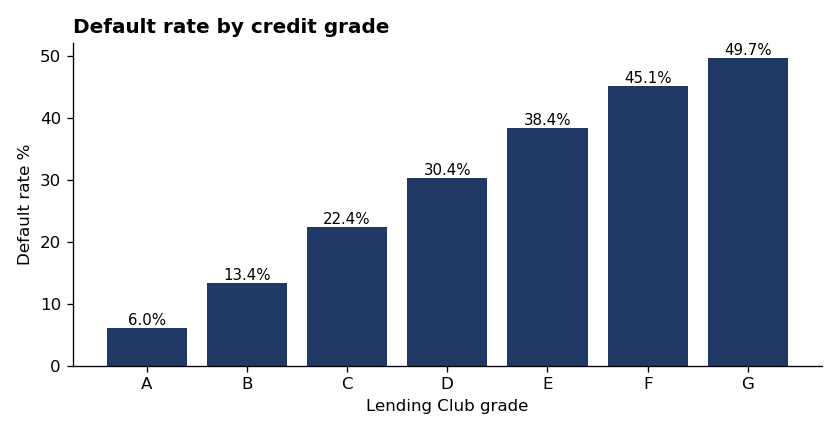
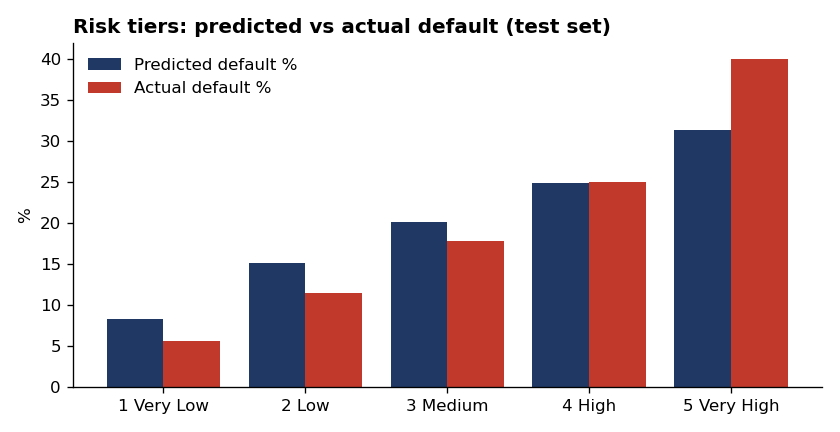
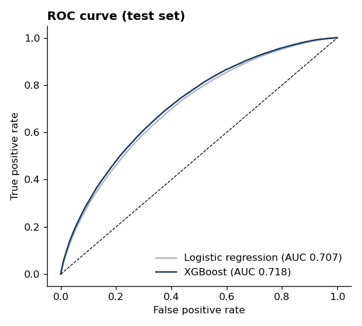
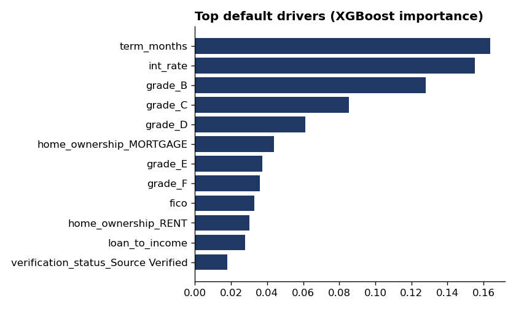

# Credit Risk & Loan Default Analysis

Which borrowers default, and how much loss does that create? This project analyzes 2M+ Lending Club consumer loans with SQL, builds default prediction models in Python, and turns the model into what a credit risk team actually uses: risk tiers and expected loss.

**Tools:** SQL (DuckDB) · Python (pandas, scikit-learn, XGBoost) · Excel (openpyxl) · matplotlib · Tableau-ready output

## Business questions

1. What drives default: credit grade, income, FICO, loan purpose, geography?
2. Can we predict default at application time better than the lender's own grades?
3. How should the portfolio be segmented by risk, and what loss should we expect in each segment?

## Results

<!-- RESULTS_START -->
| Metric | Value |
|---|---|
| Raw loan records | 2,260,701 |
| Finished loans analyzed | 1,347,734 |
| Loan volume | $19,418,520,500 |
| Overall default rate | 19.98% |
| Logistic regression AUC (test) | 0.707 |
| XGBoost AUC (test) | 0.718 |
| Default rate, lowest-risk tier | 5.59% |
| Default rate, highest-risk tier | 39.97% (7.2x the lowest tier) |
| Top 3 drivers | term_months, int_rate, grade_B |

### Risk tiers (test set, LGD = 60%)
| risk_tier | loans | volume | predicted_pd_pct | actual_default_pct | expected_loss |
|---|---|---|---|---|---|
| 1 Very Low | 53,910 | 731,775,225 | 8.28 | 5.59 | 36,131,566 |
| 2 Low | 53,909 | 677,053,275 | 15.14 | 11.44 | 61,481,270 |
| 3 Medium | 53,909 | 708,533,625 | 20.10 | 17.87 | 85,606,899 |
| 4 High | 53,909 | 796,868,075 | 24.89 | 25.04 | 119,301,860 |
| 5 Very High | 53,910 | 972,762,200 | 31.42 | 39.97 | 184,246,127 |
<!-- RESULTS_END -->

## Approach

1. **Load (SQL):** raw file loaded into DuckDB as text, then typed and cleaned in SQL ([01_clean.sql](sql/01_clean.sql)). Only finished loans (Fully Paid or Charged Off) are kept so every row has a known outcome.
2. **Default drivers (SQL):** default rate by grade, purpose, income x FICO risk matrix, issue year, and state (ranked with a window function). See [sql/](sql/).
3. **Models (Python):** logistic regression (the interpretable baseline credit teams expect) vs. XGBoost, compared on a stratified 20% hold-out using AUC.
4. **Risk tiers and expected loss:** test-set borrowers split into five equal-size risk tiers. Expected loss per loan = probability of default × loan amount × loss given default (60% assumption).
5. **Outputs:** an 11-tab Excel risk report (`outputs/credit_risk_report.xlsx`), a 100k-row Tableau-ready sample (`outputs/loans_sample_for_tableau.csv`), and charts in `images/`.

 

## Design decisions

- **No data leakage.** Only fields known when the loan was approved are used. Including payment history would produce a near-perfect but useless model.
- **AUC, not accuracy.** With roughly 1 in 5 loans defaulting, accuracy rewards predicting "no default" for everyone. AUC measures how well the model ranks risky borrowers above safe ones.
- **Realistic performance.** An AUC around 0.70 is typical for application-only data: job loss, illness, and other future events can't be seen at application time.
- **Calibrated probabilities for expected loss.** Class weighting inflates raw model scores, so scores are rescaled to the actual default rate before calculating expected loss.

## Limitations

- Recent vintages (2017-2018) are under-represented among finished loans, because many were still being repaid when the data was published.
- The 60% LGD is an assumption; a production model would estimate it from recovery data.
